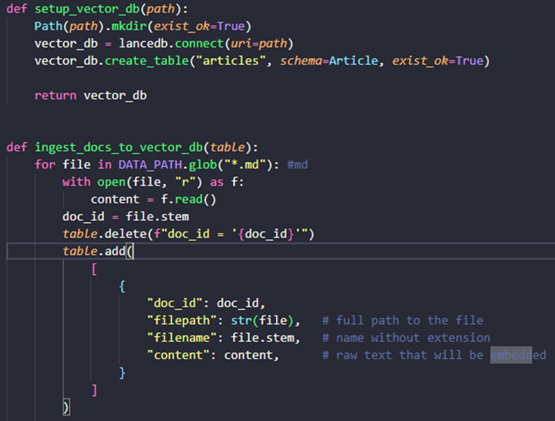
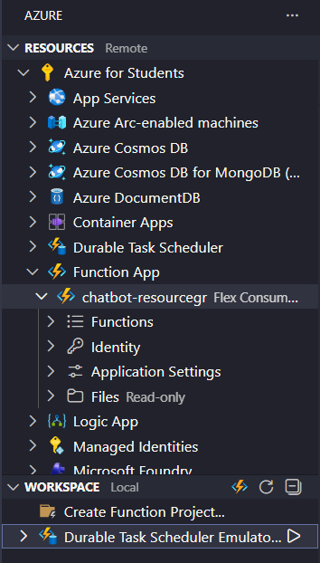
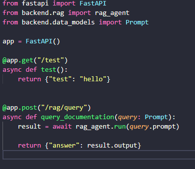
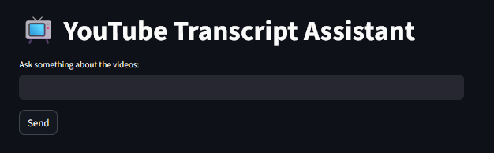
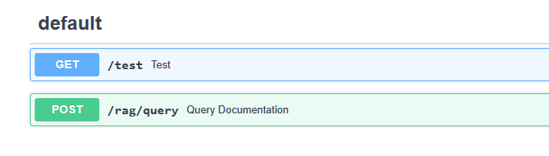

# RAG YouTuber Assistant - Documentation

## What Does This Code Do? (Step by Step)

This is a **Retrieval-Augmented Generation (RAG)** chatbot that learns from YouTube transcripts. Here's how it works:

### 1. **Data Ingestion** (`ingestion.py`)
- Reads all transcript files from the `transcripts/` folder
- Converts them into numerical representations (embeddings) so the AI can understand meaning
- Stores everything in a **vector database** (LanceDB) called `knowledge_base/`
- This is like creating an intelligent index of all your transcripts

    

### 2. **Backend Processing** (`backend/rag.py`)
- Uses **PydanticAI** with Google's Gemini AI model to power the chatbot
- When you ask a question:
  - The system searches the vector database to find the most relevant transcript sections
  - Sends those relevant excerpts to the AI model (along with your question)
  - The AI generates an answer based **only** on what's in the transcripts
  - Acts as a "teacher" that explains concepts with humor and fun facts

        Note: The backend API has been deployed to Azure Functions. This means it runs in the cloud and can respond to requests from any frontend without having to run it locally.
        

    


### 3. **API Server** (`api.py`)
- Built with **FastAPI**, a modern web framework
- Provides an endpoint `/rag/query` that accepts your questions
- Returns AI-generated answers
- This is the bridge between your chat interface and the AI brain



### 4. **User Interface** (`frontend/app.py`)
- Built with **Streamlit** (simple, beginner-friendly framework)
- Shows a chat interface where you type questions
- Keeps track of your conversation history
- Sends your questions to the API and displays the AI's answers

        Note: The frontend has been deployed to an Azure Web App, so you can also access it from any browser without running Streamlit locally. The frontend automatically talks to the Azure Function backend when deployed.


# How to Get It Running

### Prerequisites you need
    - A Google API key for Gemini
    - Prepare a enviroment & activate it 

**1. Install Dependencies**
```bash
pip install -r requirements.txt
```

**2. Start the API Server**
```bash
uvicorn api:app --reload
```
Leave this running. You'll see: `Uvicorn running on http://127.0.0.1:8000`



**3. Start the Chat Interface** (Open a new terminal/command prompt)
```bash
streamlit run frontend/app.py
```
Your browser will open automatically showing the chat interface at `http://localhost:8501`




# How Everything Is Connected

Here's a visual overview:

```
        ┌────────────────────────┐
        │          USER          │
        └──────────┬─────────────┘
                   │
                   │ Types question
                   ▼
        ┌──────────────────────┐
        │  Streamlit Frontend  │ (Azure Web App)
        │  (Chat Interface)    │
        └──────────┬───────────┘
                   │ Sends question (HTTP)
                   ▼
        ┌──────────────────────┐
        │   Azure Function     │
        │ (FastAPI / api.py)   │
        └──────────┬───────────┘
                   │ Routes to
                   ▼
        ┌──────────────────────┐
        │  PydanticAI + Gemini │ (backend/rag.py)
        │  (AI Brain)          │
        └──────────┬───────────┘
                   │ Uses tool to find
                   │ relevant content
                   ▼
        ┌──────────────────────┐
        │   LanceDB Vector     │ (knowledge_base/)
        │   Database           │
        └──────────┬───────────┘
                   │ Finds matching
                   │ transcripts
                   ▼
        ┌──────────────────────┐
        │  Your Transcripts    │ (transcripts/)
        │  (Raw Text Files)    │
        └──────────────────────┘


Data Flow:
1. ingestion.py → Reads transcripts → Converts to embeddings → Stores in LanceDB (knowledge_base)
2. User types a question → Streamlit Frontend (Azure Web App)
3. Streamlit sends HTTP request → Azure Function (FastAPI API)
4. Azure Function → RAG Agent (PydanticAI + Gemini)
5. RAG Agent → Searches LanceDB → Retrieves relevant transcript chunks
6. Gemini AI → Generates answer based on retrieved content
7. Answer → Azure Function → Frontend → Displayed to the user
```

## Key Components:

- **transcripts/** → Your raw transcript files (input data)
- **backend/** → AI logic and database connections
- **frontend/** → User-facing chat interface
- **knowledge_base/** → Vector database (automatically created)
- **api.py** → Server that connects everything
- **ingestion.py** → One-time script to populate the database
- **requirements.txt** → List of all software dependencies

**Azure Notes:**

- Backend is deployed as an Azure Function (cloud API).
- Frontend is deployed as an Azure Web App (cloud chat interface).
- You can still run the frontend locally and connect it to the Azure backend for testing.

---

### What's Next?

- **Add more transcripts:** Just drop `.md` files into `transcripts/` and run `ingestion.py` again
- **Customize the AI personality:** Edit the `system_prompt` in `backend/rag.py`
- **Improve answers:** Adjust the number of retrieved documents (change `k=3` in the `retrieve_top_documents` function)


